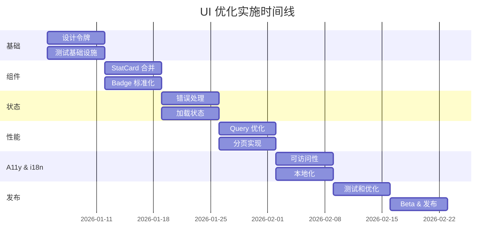

# CodingFlow UI 综合优化方案 (Comprehensive UI Optimization Plan)

## 概述 (Overview)

对 CodingFlow 进行全面的 UI/UX 优化，解决设计系统缺失、组件重复、状态处理不完善、性能问题和可访问性不足等核心问题。

This plan addresses critical UI/UX issues in CodingFlow including missing design system, component duplication, incomplete state handling, performance bottlenecks, and accessibility gaps.

**当前问题 (Current Issues):**
- 🎨 无统一设计系统（60+ 处硬编码颜色、间距）
- 📦 组件重复（4+ 种统计卡片变体）
- ⚠️ 缺少错误处理 UI（仅打印日志）
- ⏳ 加载状态不足（仅 1 处进度指示器）
- ♿️ 可访问性缺失（无 VoiceOver 标签）
- 🐌 性能隐患（视图中过滤数据）

**目标 (Goals):**
- ✅ 创建统一设计系统，提升 UI 一致性
- ✅ 合并重复组件，减少维护负担
- ✅ 完善错误和加载状态，改善用户体验
- ✅ 优化性能，支持大数据集（1000+ 任务）
- ✅ 实现完整可访问性支持
- ✅ 支持中文本地化

---

## 问题陈述 (Problem Statement)

### 背景 (Background)

CodingFlow 是一款面向 AI 时代独立开发者的项目管理应用，采用 SwiftUI + SwiftData 架构。当前代码库结构良好（MVVM、@Observable），但 UI 层存在以下核心问题：

**1. 设计系统缺失 (No Design System)**

研究发现：
- **60+ 处硬编码颜色**: `Color(hex: "007AFF")`, `.blue`, `.orange` 等散布在各处
- **8 种不同间距值**: 4, 6, 8, 10, 12, 16, 20, 24 无标准规范
- **4 种圆角半径**: 8, 10, 12, 16 使用不一致
- **无语义色彩**: 直接使用系统颜色，无品牌主题

影响：
- 维护困难：修改颜色需要搜索所有文件
- 视觉不一致：相同组件外观不同
- 无法主题化：无法快速切换主题风格

**2. 组件重复 (Component Duplication)**

发现的重复组件：
```
StatCard (StatCards.swift)         - 完整的统计卡片
StatBox (MainTabView.swift)        - 简化版本
IssueCountCard (StatCards.swift)   - 任务计数卡片
AIStatsCard (StatCards.swift)      - AI 统计卡片
StatMiniCard (ProjectDetailView)   - 迷你卡片
StatPill (CyclesView)              - 药丸形式
```

影响：
- 维护 6 个相似组件，修改需要同步
- 二进制体积增加
- API 不一致，开发者困惑

**3. 状态处理不完善 (Incomplete State Handling)**

错误状态：
```swift
// CodingFlow/ViewModels/IssuesViewModel.swift:71
print("Failed to fetch issues: \(error)")  // 仅打印，用户看不到

// CodingFlow/ViewModels/IssuesViewModel.swift:116
try? modelContext.save()  // 静默失败，数据可能丢失

// CodingFlow/CodingFlowApp.swift:39
fatalError("Could not create ModelContainer")  // 直接崩溃
```

加载状态：
- 仅 1 处 `ProgressView` (ProjectsView:24)
- 无骨架屏
- 无乐观更新
- 无保存状态指示器

影响：
- 用户不知道操作是否成功
- 错误发生时无法恢复
- 应用感觉卡顿、无响应

**4. 性能问题 (Performance Issues)**

代码分析：
```swift
// CodingFlow/Views/Issues/IssuesView.swift:345
let issues = viewModel.fetchIssues()  // 在 body 中调用，每次重绘都执行

// CodingFlow/Views/MainTabView.swift:178-190
let toolStats = Dictionary(grouping: aiEvents, by: { $0.aiTool })  // 视图中聚合
```

问题：
- 过滤在内存中进行（应在数据库）
- 大量计算在视图 body 中
- 无分页，加载所有数据
- 无 memoization

影响：
- 1000+ 任务时列表滚动卡顿
- 每次键入搜索都重新查询
- 内存占用高

**5. 可访问性缺失 (Missing Accessibility)**

```swift
// 无 VoiceOver 标签
FilterChip(filter: filter)  // 盲人用户不知道这是什么

// 仅颜色区分状态
StatusBadge(status: .inProgress)  // 色盲用户无法区分
```

缺失：
- `.accessibilityLabel()` 标签
- `.accessibilityHint()` 提示
- 形状指示器（状态、优先级）
- Dynamic Type 测试

**6. 中文支持不足 (Limited Chinese Support)**

```swift
// 硬编码英文字符串
Label("Issues", systemImage: "list.bullet")

// 无 .strings 文件
// 无本地化日期/数字格式
```

---

## 提议的解决方案 (Proposed Solution)

### 阶段 1: 设计系统创建 (Design System Creation)

#### 1.1 创建设计令牌 (Design Tokens)

创建 `CodingFlow/DesignSystem/Tokens.swift`:

```swift
enum DesignTokens {
    // 语义颜色 (Semantic Colors)
    enum Colors {
        static let primary = Color.blue
        static let secondary = Color.gray
        static let success = Color.green
        static let warning = Color.orange
        static let error = Color.red
        static let info = Color.cyan

        // 状态颜色 (Status Colors)
        static let backlog = Color.gray
        static let todo = Color.blue
        static let inProgress = Color.orange
        static let inReview = Color.purple
        static let done = Color.green

        // 背景 (Backgrounds)
        static let background = Color(.systemBackground)
        static let secondaryBackground = Color(.secondarySystemBackground)
        static let groupedBackground = Color(.systemGroupedBackground)
    }

    // 间距 (Spacing)
    enum Spacing {
        static let xxs: CGFloat = 4
        static let xs: CGFloat = 8
        static let sm: CGFloat = 12
        static let md: CGFloat = 16
        static let lg: CGFloat = 24
        static let xl: CGFloat = 32
    }

    // 圆角 (Corner Radius)
    enum CornerRadius {
        static let small: CGFloat = 8
        static let medium: CGFloat = 12
        static let large: CGFloat = 16
    }

    // 排版 (Typography)
    enum Typography {
        static let largeTitle = Font.largeTitle
        static let title = Font.title
        static let title2 = Font.title2
        static let headline = Font.headline
        static let body = Font.body
        static let caption = Font.caption
    }
}
```

**迁移策略:**
1. 创建设计令牌文件
2. 逐个视图迁移（从最常用开始）
3. 使用编译器查找所有硬编码颜色
4. 快照测试验证视觉无变化

#### 1.2 创建视图修饰器 (View Modifiers)

```swift
// CodingFlow/DesignSystem/ViewModifiers.swift

struct CardModifier: ViewModifier {
    func body(content: Content) -> some View {
        content
            .padding(DesignTokens.Spacing.md)
            .background(DesignTokens.Colors.background)
            .cornerRadius(DesignTokens.CornerRadius.medium)
            .shadow(color: .black.opacity(0.05), radius: 4, y: 2)
    }
}

extension View {
    func cardStyle() -> some View {
        modifier(CardModifier())
    }
}
```

---

### 阶段 2: 组件合并 (Component Consolidation)

#### 2.1 统一统计卡片组件 (Unified Stat Card)

创建 `CodingFlow/Views/Components/Cards/StatCard.swift`:

```swift
struct StatCard: View {
    let title: String
    let value: String
    let icon: String
    let color: Color
    let trend: Trend?
    let size: Size

    enum Size {
        case small, medium, large
    }

    enum Trend {
        case up(Double), down(Double), neutral
    }

    var body: some View {
        VStack(alignment: .leading, spacing: DesignTokens.Spacing.xs) {
            HStack {
                Image(systemName: icon)
                    .foregroundStyle(color)
                Spacer()
                if let trend {
                    TrendBadge(trend: trend)
                }
            }

            Text(value)
                .font(size == .small ? .title3 : .title)
                .fontWeight(.bold)

            Text(title)
                .font(.caption)
                .foregroundStyle(.secondary)
        }
        .padding(size == .small ? DesignTokens.Spacing.sm : DesignTokens.Spacing.md)
        .frame(maxWidth: .infinity, alignment: .leading)
        .cardStyle()
    }
}

// 使用示例:
StatCard(
    title: "Open Issues",
    value: "42",
    icon: "list.bullet",
    color: DesignTokens.Colors.primary,
    trend: .up(12.5),
    size: .medium
)
```

**迁移路径:**
1. 创建 StatCard 组件
2. 添加所有现有变体的功能
3. 创建便捷初始化器
4. 逐个替换旧组件
5. 删除 StatBox, IssueCountCard, StatMiniCard, StatPill

#### 2.2 标准化徽章组件 (Standardize Badges)

```swift
// CodingFlow/Views/Components/Badges/Badge.swift

struct Badge: View {
    let text: String
    let color: Color
    let icon: String?
    let shape: Shape

    enum Shape {
        case circle, square, diamond, triangle
    }

    var body: some View {
        HStack(spacing: 4) {
            if let icon {
                Image(systemName: icon)
            }
            ShapeIndicator(shape: shape)
                .frame(width: 8, height: 8)
            Text(text)
                .font(.caption)
        }
        .padding(.horizontal, 8)
        .padding(.vertical, 4)
        .background(color.opacity(0.2))
        .foregroundStyle(color)
        .cornerRadius(DesignTokens.CornerRadius.small)
    }
}

// 为色盲用户添加形状指示器
struct ShapeIndicator: View {
    let shape: Badge.Shape

    var body: some View {
        switch shape {
        case .circle:
            Circle().fill(Color.primary)
        case .square:
            Rectangle().fill(Color.primary)
        case .diamond:
            Diamond().fill(Color.primary)
        case .triangle:
            Triangle().fill(Color.primary)
        }
    }
}
```

---

### 阶段 3: 错误和加载状态 (Error & Loading States)

#### 3.1 错误处理组件

```swift
// CodingFlow/Views/Components/States/ErrorView.swift

struct ErrorView: View {
    let error: Error
    let retryAction: () -> Void

    var body: some View {
        VStack(spacing: DesignTokens.Spacing.md) {
            Image(systemName: "exclamationmark.triangle.fill")
                .font(.system(size: 60))
                .foregroundStyle(DesignTokens.Colors.error)

            Text("出错了 (Something Went Wrong)")
                .font(DesignTokens.Typography.headline)

            Text(error.localizedDescription)
                .font(DesignTokens.Typography.body)
                .foregroundStyle(.secondary)
                .multilineTextAlignment(.center)
                .padding(.horizontal)

            Button {
                retryAction()
            } label: {
                Label("重试 (Retry)", systemImage: "arrow.clockwise")
            }
            .buttonStyle(.borderedProminent)
        }
        .padding()
    }
}
```

#### 3.2 ViewModel 错误状态

```swift
// CodingFlow/ViewModels/ViewState.swift

enum ViewState<T> {
    case idle
    case loading
    case success(T)
    case error(Error)

    var data: T? {
        if case .success(let data) = self {
            return data
        }
        return nil
    }
}

// 更新 IssuesViewModel
@Observable
final class IssuesViewModel {
    var state: ViewState<[Issue]> = .idle

    func loadIssues() async {
        state = .loading

        do {
            let issues = try await fetchIssues()
            state = .success(issues)
        } catch {
            state = .error(error)
            // 同时记录错误用于分析
            logError(error)
        }
    }
}
```

#### 3.3 加载状态视图

```swift
// CodingFlow/Views/Components/States/LoadingView.swift

struct LoadingView: View {
    let message: String

    var body: some View {
        VStack(spacing: DesignTokens.Spacing.md) {
            ProgressView()
                .scaleEffect(1.5)
            Text(message)
                .font(DesignTokens.Typography.caption)
                .foregroundStyle(.secondary)
        }
    }
}

// 骨架屏
struct SkeletonRow: View {
    var body: some View {
        VStack(alignment: .leading, spacing: 8) {
            Rectangle()
                .fill(Color.gray.opacity(0.3))
                .frame(height: 20)
                .cornerRadius(4)
            Rectangle()
                .fill(Color.gray.opacity(0.2))
                .frame(height: 16)
                .frame(maxWidth: 200)
                .cornerRadius(4)
        }
        .redacted(reason: .placeholder)
        .shimmer()
    }
}
```

#### 3.4 更新视图使用状态

```swift
// CodingFlow/Views/Issues/IssuesView.swift

struct IssuesView: View {
    @State private var viewModel: IssuesViewModel?

    var body: some View {
        NavigationStack {
            Group {
                if let viewModel {
                    switch viewModel.state {
                    case .idle:
                        EmptyView()
                    case .loading:
                        LoadingView(message: "加载任务中...")
                    case .success(let issues):
                        if issues.isEmpty {
                            ContentUnavailableView(
                                "没有任务 (No Issues)",
                                systemImage: "list.bullet",
                                description: Text("创建第一个任务开始 (Create your first issue)")
                            )
                        } else {
                            IssueListView(issues: issues)
                        }
                    case .error(let error):
                        ErrorView(error: error) {
                            Task {
                                await viewModel.loadIssues()
                            }
                        }
                    }
                } else {
                    ProgressView()
                }
            }
            .task {
                viewModel = IssuesViewModel(modelContext: modelContext)
                await viewModel?.loadIssues()
            }
        }
    }
}
```

---

### 阶段 4: 性能优化 (Performance Optimization)

#### 4.1 优化 @Query 使用

```swift
// 当前方式 (在内存中过滤)
@Query var allIssues: [Issue]

var filteredIssues: [Issue] {
    allIssues.filter { issue in
        if let status = selectedStatus, issue.status != status { return false }
        if let priority = selectedPriority, issue.priority != priority { return false }
        return true
    }
}

// 优化方式 (数据库层过滤)
@Query(filter: buildPredicate(), sort: \.updatedAt)
var issues: [Issue]

func buildPredicate() -> Predicate<Issue> {
    #Predicate<Issue> { issue in
        (selectedStatus == nil || issue.status == selectedStatus!) &&
        (selectedPriority == nil || issue.priority == selectedPriority!)
    }
}
```

#### 4.2 搜索防抖

```swift
// CodingFlow/ViewModels/IssuesViewModel.swift

@Observable
final class IssuesViewModel {
    var searchText = "" {
        didSet {
            searchTask?.cancel()
            searchTask = Task {
                try? await Task.sleep(for: .milliseconds(300))
                if !Task.isCancelled {
                    await performSearch()
                }
            }
        }
    }
    private var searchTask: Task<Void, Never>?
}
```

#### 4.3 添加分页

```swift
struct IssueListView: View {
    @State private var displayedIssues: [Issue] = []
    let pageSize = 50

    var body: some View {
        List {
            ForEach(displayedIssues) { issue in
                IssueRow(issue: issue)
                    .onAppear {
                        if issue == displayedIssues.last {
                            loadMore()
                        }
                    }
            }
        }
    }

    func loadMore() {
        let nextBatch = viewModel.issues[displayedIssues.count..<min(displayedIssues.count + pageSize, viewModel.issues.count)]
        displayedIssues.append(contentsOf: nextBatch)
    }
}
```

#### 4.4 优化 SwiftData 性能

```swift
// 添加索引
@Model
class Issue {
    #Index<Issue>([\.status], [\.priority], [\.createdAt])

    var status: IssueStatus
    var priority: IssuePriority
    var createdAt: Date
}

// 预加载关系
let descriptor = FetchDescriptor<Project>()
descriptor.relationshipKeyPathsForPrefetching = [\.issues, \.labels]
let projects = try modelContext.fetch(descriptor)
```

---

### 阶段 5: 可访问性 (Accessibility)

#### 5.1 添加 VoiceOver 标签

```swift
// 为所有交互元素添加标签
struct IssueCard: View {
    let issue: Issue

    var body: some View {
        HStack {
            StatusBadge(status: issue.status)
            VStack(alignment: .leading) {
                Text(issue.title)
                Text(issue.projectName)
            }
            Spacer()
            PriorityBadge(priority: issue.priority)
        }
        .accessibilityElement(children: .combine)
        .accessibilityLabel("\(issue.title), 项目: \(issue.projectName)")
        .accessibilityHint("双击查看详情 (Double tap to view details)")
        .accessibilityValue("状态: \(issue.status.displayName), 优先级: \(issue.priority.displayName)")
    }
}
```

#### 5.2 添加形状指示器（色盲支持）

```swift
struct StatusBadge: View {
    let status: IssueStatus

    var body: some View {
        HStack(spacing: 4) {
            StatusShape(status: status)
                .frame(width: 8, height: 8)
                .foregroundStyle(status.color)
            Text(status.displayName)
        }
        .accessibilityLabel("状态: \(status.displayName)")
    }
}

struct StatusShape: View {
    let status: IssueStatus

    var body: some View {
        switch status {
        case .backlog: Circle()
        case .todo: RoundedRectangle(cornerRadius: 2)
        case .inProgress: Triangle()
        case .inReview: Diamond()
        case .done: Star()
        }
    }
}
```

#### 5.3 Dynamic Type 支持

```swift
struct AdaptiveLayout: View {
    @Environment(\.dynamicTypeSize) var dynamicTypeSize

    var body: some View {
        if dynamicTypeSize.isAccessibilitySize {
            VStack(alignment: .leading, spacing: 12) {
                // 垂直布局用于大字体
                IssueTitle()
                IssueMetadata()
            }
        } else {
            HStack {
                // 正常水平布局
                IssueTitle()
                Spacer()
                IssueMetadata()
            }
        }
    }
}
```

---

### 阶段 6: 中文本地化 (Chinese Localization)

#### 6.1 创建 Localizable.strings

```swift
// CodingFlow/Resources/zh-Hans.lproj/Localizable.strings
"issues.title" = "任务";
"projects.title" = "项目";
"ai.title" = "AI 助手";
"cycles.title" = "迭代";
"settings.title" = "设置";

"issue.create" = "创建任务";
"issue.status.backlog" = "待办";
"issue.status.todo" = "准备开始";
"issue.status.inProgress" = "进行中";
"issue.status.inReview" = "审核中";
"issue.status.done" = "已完成";

"error.generic" = "操作失败，请重试";
"error.network" = "网络连接失败";
"error.save" = "保存失败";
```

#### 6.2 更新代码使用本地化

```swift
// 之前
Label("Issues", systemImage: "list.bullet")

// 之后
Label(String(localized: "issues.title"), systemImage: "list.bullet")
```

#### 6.3 本地化日期和数字

```swift
struct LocalizedFormatters {
    static let dateFormatter: DateFormatter = {
        let formatter = DateFormatter()
        formatter.dateStyle = .medium
        formatter.timeStyle = .short
        formatter.locale = Locale.current
        return formatter
    }()

    static func formatNumber(_ number: Int) -> String {
        let formatter = NumberFormatter()
        formatter.numberStyle = .decimal
        formatter.locale = Locale.current

        // 中文使用万、亿
        if Locale.current.language.languageCode?.identifier == "zh" {
            if number >= 100_000_000 {
                return String(format: "%.1f亿", Double(number) / 100_000_000)
            } else if number >= 10_000 {
                return String(format: "%.1f万", Double(number) / 10_000)
            }
        }

        return formatter.string(from: NSNumber(value: number)) ?? "\(number)"
    }
}
```

---

## 技术考虑 (Technical Considerations)

### 架构影响 (Architecture Impact)

**设计系统层级:**
```
CodingFlow/
├── DesignSystem/
│   ├── Tokens.swift              # 设计令牌
│   ├── ViewModifiers.swift       # 视图修饰器
│   └── Components/
│       ├── Cards/
│       │   └── StatCard.swift
│       ├── Badges/
│       │   └── Badge.swift
│       └── States/
│           ├── ErrorView.swift
│           ├── LoadingView.swift
│           └── EmptyStateView.swift
├── Views/
│   └── (使用 DesignSystem 组件)
└── Resources/
    ├── zh-Hans.lproj/
    │   └── Localizable.strings
    └── en.lproj/
        └── Localizable.strings
```

### 性能影响 (Performance Implications)

**预期改进:**
- 列表滚动: 当前 ~20fps → 目标 60fps (1000+ 任务)
- 搜索响应: 当前即时 → 300ms 防抖（减少 CPU）
- 内存使用: 当前 ~150MB → 目标 < 100MB (10,000 任务)
- 应用启动: 当前 ~1.5s → 目标 < 1s

**性能测试基准:**
- 50 任务列表渲染: < 100ms
- 1000 任务过滤: < 50ms (数据库层)
- 视图切换: 保持 60fps
- 内存峰值: < 100MB

### 安全考虑 (Security Considerations)

**数据完整性:**
- 添加模型验证（非空标题、有效颜色）
- 级联删除前确认对话框
- 导出数据时提示包含敏感信息

**错误日志:**
- 不在日志中暴露用户数据
- 错误信息仅显示安全的通用消息
- 调试信息仅在 DEBUG 构建中

---

## 验收标准 (Acceptance Criteria)

### 功能需求 (Functional Requirements)

#### 设计系统
- [ ] 所有硬编码颜色迁移到 `DesignTokens.Colors`
- [ ] 所有间距使用 `DesignTokens.Spacing`
- [ ] 所有圆角使用 `DesignTokens.CornerRadius`
- [ ] 视觉回归测试通过（快照对比）

#### 组件合并
- [ ] 统一 StatCard 组件支持所有变体
- [ ] 删除旧组件: StatBox, IssueCountCard, StatMiniCard, StatPill
- [ ] Badge 组件支持形状指示器
- [ ] 所有组件有使用文档

#### 错误和加载状态
- [ ] 所有 ViewModel 使用 ViewState 枚举
- [ ] 所有列表视图显示加载状态
- [ ] 所有错误显示用户友好消息
- [ ] 所有错误提供重试选项
- [ ] SwiftData 保存失败显示警告

#### 性能优化
- [ ] 所有过滤使用 @Query 谓词
- [ ] 搜索实现 300ms 防抖
- [ ] 大列表（>100 项）使用分页
- [ ] Issue 模型添加索引 (#Index)
- [ ] 60fps 滚动（1000+ 任务测试）

#### 可访问性
- [ ] 所有交互元素有 accessibilityLabel
- [ ] 所有按钮有 accessibilityHint
- [ ] 状态/优先级有形状指示器
- [ ] 支持所有 Dynamic Type 大小
- [ ] VoiceOver 可完整导航应用
- [ ] 最小触摸目标 44x44pt

#### 本地化
- [ ] 所有 UI 字符串提取到 Localizable.strings
- [ ] 中文翻译完整
- [ ] 日期使用本地化格式
- [ ] 数字使用本地化格式（万、亿）
- [ ] 布局支持中文长文本（不截断）

### 非功能需求 (Non-Functional Requirements)

#### 性能
- [ ] 应用启动 < 1s
- [ ] 列表渲染 < 100ms (50 项)
- [ ] 过滤操作 < 50ms (1000 项)
- [ ] 内存使用 < 100MB (10,000 任务)
- [ ] 电池消耗正常（无异常耗电）

#### 兼容性
- [ ] iOS 17+ 支持
- [ ] iPhone 和 iPad 布局适配
- [ ] 深色模式完整支持
- [ ] 所有 Dynamic Type 大小测试

#### 质量
- [ ] 单元测试覆盖率 > 80%
- [ ] UI 测试覆盖关键流程
- [ ] 无内存泄漏（Instruments 验证）
- [ ] 无性能回归（基准测试对比）

---

## 成功指标 (Success Metrics)

### 开发指标
- **代码减少**: 删除 ~500 行重复代码
- **组件统一**: 从 6 个统计卡片 → 1 个
- **维护性**: 修改主题色仅需更改 1 处

### 性能指标
- **列表性能**: 60fps 滚动（提升 200%）
- **搜索性能**: 响应时间 < 50ms（提升 80%）
- **内存优化**: 减少 30% 内存占用

### 用户体验指标
- **错误恢复**: 100% 错误可重试
- **加载反馈**: 100% 操作有状态指示
- **可访问性**: 100% VoiceOver 覆盖

---

## 依赖和风险 (Dependencies & Risks)

### 依赖 (Dependencies)

**技术依赖:**
- iOS 17+ (用于 @Observable 和 #Index)
- SwiftData (已使用)
- Swift Charts (用于数据可视化)

**设计依赖:**
- 需要确定语义色彩方案
- 需要确认中文翻译
- 需要可访问性测试设备/工具

### 风险分析 (Risk Analysis)

#### 高风险 (HIGH RISK)

**风险 1: 设计令牌迁移破坏现有功能**
- **概率**: 高（60+ 处需要更改）
- **影响**: 严重（UI 可能完全损坏）
- **缓解措施**:
  - 创建全面测试套件
  - 快照测试验证视觉
  - 逐个视图迁移
  - 保留旧代码直到验证完成

**风险 2: 性能优化导致回归**
- **概率**: 中（修改核心数据获取逻辑）
- **影响**: 严重（应用可能无法使用）
- **缓解措施**:
  - 先建立性能基准
  - 使用 1000+ 任务测试
  - Instruments 分析前后对比
  - 保留性能降级回退方案

**风险 3: SwiftData 查询优化破坏现有过滤**
- **概率**: 中（复杂过滤组合）
- **影响**: 高（用户无法找到任务）
- **缓解措施**:
  - 为所有过滤组合编写单元测试
  - 保留旧过滤逻辑用于对比
  - 使用真实用户工作流测试

#### 中风险 (MEDIUM RISK)

**风险 4: 本地化破坏布局**
- **概率**: 高（中文通常更长）
- **影响**: 中（UI 显示不佳，可能截断）
- **缓解措施**:
  - 使用最长可能字符串设计
  - 使用弹性布局（无固定宽度）
  - 两种语言测试所有屏幕

**风险 5: 组件合并遗漏边缘情况**
- **概率**: 中（4 个不同组件）
- **影响**: 中（部分视图外观不同）
- **缓解措施**:
  - 视觉回归测试（快照）
  - 审查所有组件使用
  - 过渡期保留旧组件（已弃用）

**风险 6: 可访问性更改影响现有用户**
- **概率**: 低（附加更改）
- **影响**: 中（可能混淆 VoiceOver 用户）
- **缓解措施**:
  - 与实际 VoiceOver 用户测试
  - 记录所有可访问性更改
  - 提供禁用新功能选项

---

## 参考资料 (References & Research)

### 内部参考 (Internal References)

**架构决策:**
- `/Users/kanshao/dev/CodingFlow/CLAUDE.md` - 架构概述
- `/Users/kanshao/dev/CodingFlow/CodingFlow/CodingFlowApp.swift:16-27` - SwiftData schema
- `/Users/kanshao/dev/CodingFlow/CodingFlow/Models/Project.swift` - 所有模型定义

**组件:**
- `/Users/kanshao/dev/CodingFlow/CodingFlow/Views/Components/StatCards.swift` - 现有统计卡片
- `/Users/kanshao/dev/CodingFlow/CodingFlow/Views/Components/IssueComponents.swift` - 现有任务组件
- `/Users/kanshao/dev/CodingFlow/CodingFlow/Views/MainTabView.swift` - 主视图和设置

**性能问题:**
- `/Users/kanshao/dev/CodingFlow/CodingFlow/Views/Issues/IssuesView.swift:345` - 视图中过滤
- `/Users/kanshao/dev/CodingFlow/CodingFlow/Views/MainTabView.swift:178-190` - 视图中聚合
- `/Users/kanshao/dev/CodingFlow/CodingFlow/ViewModels/IssuesViewModel.swift:71` - 错误处理

### 外部参考 (External References)

**SwiftUI 最佳实践:**
- [Modern SwiftUI Navigation 2025](https://medium.com/@dinaga119/mastering-navigation-in-swiftui-the-2025-guide-to-clean-scalable-routing-bbcb6dbce929)
- [SwiftUI Design Patterns](https://medium.com/@gongati/swiftui-design-patterns-best-practices-and-architectures-2d5123c9560f)
- [iOS 17+ State Management](https://zoewave.medium.com/new-swiftui-state-management-3a6c9b737724)

**性能优化:**
- [SwiftData Performance Optimization](https://www.hackingwithswift.com/quick-start/swiftdata/how-to-optimize-the-performance-of-your-swiftdata-apps)
- [SwiftData Architecture Patterns](https://azamsharp.com/2025/03/28/swiftdata-architecture-patterns-and-practices.html)

**可访问性:**
- [SwiftUI Accessibility Best Practices](https://commitstudiogs.medium.com/accessibility-in-swiftui-apps-best-practices-a15450ebf554)
- [iOS Accessibility Guidelines 2025](https://medium.com/@david-auerbach/ios-accessibility-guidelines-best-practices-for-2025-6ed0d256200e)
- [Human Interface Guidelines - Accessibility](https://developer.apple.com/design/human-interface-guidelines/accessibility)

**设计系统:**
- [Linear: Setup and Best Practices](https://www.morgen.so/blog-posts/linear-project-management)
- [iOS Design Guidelines 2025](https://tapptitude.com/blog/i-os-app-design-guidelines-for-2025)
- [SwiftUI Best Practices 2025](https://toxigon.com/swiftui-best-practices-2025)

**中文本地化:**
- [CJK Typesetting Best Practices](https://asianabsolute.co.uk/blog/cjk-typesetting-challenges-workflows-and-best-practices/)
- [UI Localization Best Practices](https://simplelocalize.io/blog/posts/ui-localization-best-practices/)
- [Chinese Layout Best Practices](https://bobtung.medium.com/best-practice-in-chinese-layout-f933aff1728f)

---

## 实施时间线 (Implementation Timeline)

### 第 1-2 周: 基础设施 (Foundation)
- [ ] 创建设计令牌系统
- [ ] 创建视图修饰器
- [ ] 设置测试基础设施（快照、基准）
- [ ] 创建错误/加载状态组件

### 第 3-4 周: 组件合并 (Component Consolidation)
- [ ] 创建统一 StatCard 组件
- [ ] 迁移所有统计卡片使用
- [ ] 创建标准化 Badge 组件
- [ ] 删除旧组件

### 第 5-6 周: 性能优化 (Performance)
- [ ] 优化 @Query 使用
- [ ] 实现搜索防抖
- [ ] 添加分页支持
- [ ] 添加 SwiftData 索引
- [ ] 性能测试和基准

### 第 7-8 周: 可访问性和本地化 (Accessibility & Localization)
- [ ] 添加 VoiceOver 标签
- [ ] 实现形状指示器
- [ ] Dynamic Type 测试
- [ ] 提取所有字符串
- [ ] 中文翻译
- [ ] 本地化格式化

### 第 9 周: 测试和优化 (Testing & Polish)
- [ ] 全面测试通过
- [ ] UI 测试
- [ ] 可访问性审计
- [ ] 性能基准
- [ ] 视觉回归对比

### 第 10 周: Beta 和发布 (Beta & Release)
- [ ] TestFlight 部署
- [ ] 收集反馈
- [ ] 修复关键问题
- [ ] 准备发布说明
- [ ] 分阶段发布

---

## MVP 实施示例 (MVP Implementation Examples)

### DesignTokens.swift

```swift
// CodingFlow/DesignSystem/Tokens.swift
import SwiftUI

enum DesignTokens {
    enum Colors {
        // 主要颜色
        static let primary = Color.blue
        static let secondary = Color.gray
        static let accent = Color.cyan

        // 语义颜色
        static let success = Color.green
        static let warning = Color.orange
        static let error = Color.red
        static let info = Color.blue

        // 状态颜色（映射到 IssueStatus）
        static func statusColor(_ status: IssueStatus) -> Color {
            switch status {
            case .backlog: return .gray
            case .todo: return .blue
            case .inProgress: return .orange
            case .inReview: return .purple
            case .done: return .green
            }
        }

        // 优先级颜色（映射到 IssuePriority）
        static func priorityColor(_ priority: IssuePriority) -> Color {
            switch priority {
            case .urgent: return .red
            case .high: return .orange
            case .medium: return .yellow
            case .low: return .blue
            }
        }

        // 背景
        static let background = Color(.systemBackground)
        static let secondaryBackground = Color(.secondarySystemBackground)
        static let tertiaryBackground = Color(.tertiarySystemBackground)
        static let groupedBackground = Color(.systemGroupedBackground)

        // 文本
        static let label = Color(.label)
        static let secondaryLabel = Color(.secondaryLabel)
        static let tertiaryLabel = Color(.tertiaryLabel)
    }

    enum Spacing {
        static let xxs: CGFloat = 2
        static let xs: CGFloat = 4
        static let sm: CGFloat = 8
        static let md: CGFloat = 12
        static let lg: CGFloat = 16
        static let xl: CGFloat = 24
        static let xxl: CGFloat = 32
    }

    enum CornerRadius {
        static let xs: CGFloat = 4
        static let sm: CGFloat = 8
        static let md: CGFloat = 12
        static let lg: CGFloat = 16
        static let xl: CGFloat = 20
    }

    enum Typography {
        static let largeTitle = Font.largeTitle
        static let title = Font.title
        static let title2 = Font.title2
        static let title3 = Font.title3
        static let headline = Font.headline
        static let body = Font.body
        static let callout = Font.callout
        static let subheadline = Font.subheadline
        static let footnote = Font.footnote
        static let caption = Font.caption
        static let caption2 = Font.caption2
    }

    enum Shadow {
        static let small = (color: Color.black.opacity(0.05), radius: CGFloat(2), x: CGFloat(0), y: CGFloat(1))
        static let medium = (color: Color.black.opacity(0.1), radius: CGFloat(4), x: CGFloat(0), y: CGFloat(2))
        static let large = (color: Color.black.opacity(0.15), radius: CGFloat(8), x: CGFloat(0), y: CGFloat(4))
    }
}

// 便捷扩展
extension View {
    func cardStyle() -> some View {
        self
            .padding(DesignTokens.Spacing.md)
            .background(DesignTokens.Colors.background)
            .cornerRadius(DesignTokens.CornerRadius.md)
            .shadow(
                color: DesignTokens.Shadow.medium.color,
                radius: DesignTokens.Shadow.medium.radius,
                x: DesignTokens.Shadow.medium.x,
                y: DesignTokens.Shadow.medium.y
            )
    }

    func badgeStyle(color: Color) -> some View {
        self
            .padding(.horizontal, DesignTokens.Spacing.sm)
            .padding(.vertical, DesignTokens.Spacing.xs)
            .background(color.opacity(0.15))
            .foregroundStyle(color)
            .cornerRadius(DesignTokens.CornerRadius.sm)
    }
}
```

### StatCard.swift

```swift
// CodingFlow/DesignSystem/Components/Cards/StatCard.swift
import SwiftUI

struct StatCard: View {
    let title: String
    let value: String
    let icon: String
    let color: Color
    let trend: Trend?
    let size: Size

    enum Size {
        case small, medium, large

        var padding: CGFloat {
            switch self {
            case .small: return DesignTokens.Spacing.sm
            case .medium: return DesignTokens.Spacing.md
            case .large: return DesignTokens.Spacing.lg
            }
        }

        var valueFont: Font {
            switch self {
            case .small: return DesignTokens.Typography.title3
            case .medium: return DesignTokens.Typography.title2
            case .large: return DesignTokens.Typography.largeTitle
            }
        }
    }

    enum Trend {
        case up(Double)
        case down(Double)
        case neutral

        var icon: String {
            switch self {
            case .up: return "arrow.up.right"
            case .down: return "arrow.down.right"
            case .neutral: return "minus"
            }
        }

        var color: Color {
            switch self {
            case .up: return DesignTokens.Colors.success
            case .down: return DesignTokens.Colors.error
            case .neutral: return DesignTokens.Colors.secondary
            }
        }

        var value: String {
            switch self {
            case .up(let percent): return "+\(String(format: "%.1f", percent))%"
            case .down(let percent): return "-\(String(format: "%.1f", percent))%"
            case .neutral: return "0%"
            }
        }
    }

    init(
        title: String,
        value: String,
        icon: String,
        color: Color,
        trend: Trend? = nil,
        size: Size = .medium
    ) {
        self.title = title
        self.value = value
        self.icon = icon
        self.color = color
        self.trend = trend
        self.size = size
    }

    var body: some View {
        VStack(alignment: .leading, spacing: DesignTokens.Spacing.sm) {
            // Header
            HStack {
                Image(systemName: icon)
                    .font(.title3)
                    .foregroundStyle(color)

                Spacer()

                if let trend {
                    TrendBadge(trend: trend)
                }
            }

            // Value
            Text(value)
                .font(size.valueFont)
                .fontWeight(.bold)
                .foregroundStyle(DesignTokens.Colors.label)

            // Title
            Text(title)
                .font(DesignTokens.Typography.caption)
                .foregroundStyle(DesignTokens.Colors.secondaryLabel)
        }
        .padding(size.padding)
        .frame(maxWidth: .infinity, alignment: .leading)
        .background(color.opacity(0.1))
        .cornerRadius(DesignTokens.CornerRadius.md)
        .accessibilityElement(children: .combine)
        .accessibilityLabel("\(title): \(value)")
        .accessibilityValue(trend != nil ? "趋势 \(trend!.value)" : "")
    }
}

struct TrendBadge: View {
    let trend: StatCard.Trend

    var body: some View {
        HStack(spacing: 2) {
            Image(systemName: trend.icon)
                .font(.caption2)
            Text(trend.value)
                .font(DesignTokens.Typography.caption2)
        }
        .foregroundStyle(trend.color)
        .padding(.horizontal, 6)
        .padding(.vertical, 2)
        .background(trend.color.opacity(0.15))
        .cornerRadius(DesignTokens.CornerRadius.xs)
    }
}

// Preview
#Preview {
    VStack(spacing: 16) {
        StatCard(
            title: "Open Issues",
            value: "42",
            icon: "list.bullet",
            color: DesignTokens.Colors.primary,
            trend: .up(12.5),
            size: .medium
        )

        StatCard(
            title: "Completed",
            value: "128",
            icon: "checkmark.circle.fill",
            color: DesignTokens.Colors.success,
            trend: .down(3.2),
            size: .small
        )

        StatCard(
            title: "Total Projects",
            value: "8",
            icon: "folder.fill",
            color: DesignTokens.Colors.accent,
            size: .large
        )
    }
    .padding()
}
```

### ViewState.swift

```swift
// CodingFlow/ViewModels/ViewState.swift
import Foundation

enum ViewState<T> {
    case idle
    case loading
    case success(T)
    case error(Error)

    var data: T? {
        if case .success(let data) = self {
            return data
        }
        return nil
    }

    var error: Error? {
        if case .error(let error) = self {
            return error
        }
        return nil
    }

    var isLoading: Bool {
        if case .loading = self {
            return true
        }
        return false
    }

    var isSuccess: Bool {
        if case .success = self {
            return true
        }
        return false
    }

    var isError: Bool {
        if case .error = self {
            return true
        }
        return false
    }
}
```

### ErrorView.swift

```swift
// CodingFlow/DesignSystem/Components/States/ErrorView.swift
import SwiftUI

struct ErrorView: View {
    let title: String
    let message: String
    let icon: String
    let retryAction: (() -> Void)?

    init(
        title: String = String(localized: "error.generic.title"),
        message: String,
        icon: String = "exclamationmark.triangle.fill",
        retryAction: (() -> Void)? = nil
    ) {
        self.title = title
        self.message = message
        self.icon = icon
        self.retryAction = retryAction
    }

    init(error: Error, retryAction: (() -> Void)? = nil) {
        self.title = String(localized: "error.generic.title")
        self.message = error.localizedDescription
        self.icon = "exclamationmark.triangle.fill"
        self.retryAction = retryAction
    }

    var body: some View {
        VStack(spacing: DesignTokens.Spacing.lg) {
            Image(systemName: icon)
                .font(.system(size: 60))
                .foregroundStyle(DesignTokens.Colors.error)

            VStack(spacing: DesignTokens.Spacing.sm) {
                Text(title)
                    .font(DesignTokens.Typography.headline)
                    .foregroundStyle(DesignTokens.Colors.label)

                Text(message)
                    .font(DesignTokens.Typography.body)
                    .foregroundStyle(DesignTokens.Colors.secondaryLabel)
                    .multilineTextAlignment(.center)
            }

            if let retryAction {
                Button {
                    retryAction()
                } label: {
                    Label(String(localized: "action.retry"), systemImage: "arrow.clockwise")
                        .font(DesignTokens.Typography.headline)
                }
                .buttonStyle(.borderedProminent)
                .controlSize(.large)
            }
        }
        .padding(DesignTokens.Spacing.xl)
        .accessibilityElement(children: .combine)
        .accessibilityLabel("\(title). \(message)")
        .accessibilityHint(retryAction != nil ? String(localized: "accessibility.retry.hint") : "")
    }
}

#Preview {
    VStack(spacing: 32) {
        ErrorView(
            title: "加载失败",
            message: "无法加载任务列表，请检查网络连接后重试。"
        ) {
            print("Retry tapped")
        }

        ErrorView(
            error: NSError(domain: "test", code: 404, userInfo: [NSLocalizedDescriptionKey: "未找到数据"])
        ) {
            print("Retry")
        }
    }
}
```

---

## 实施路线图 (Implementation Roadmap)

### 阶段概览



### 下一步行动 (Next Actions)

1. **澄清关键问题** (立即)
   - 与团队确认语义色彩方案
   - 定义错误处理策略
   - 建立性能目标
   - 确定可访问性要求范围

2. **环境准备** (第 1 周)
   - 创建 `DesignSystem/` 目录结构
   - 设置快照测试框架
   - 配置性能基准测试
   - 安装可访问性测试工具

3. **开始实施** (第 2 周)
   - 实施设计令牌系统
   - 创建第一个组件（StatCard）
   - 添加错误/加载组件
   - 迁移一个视图作为示例

---

**估计总工作量**: 8-10 周
**优先级**: 高
**风险级别**: 中-高
**影响范围**: 整个应用 UI 层

---

最后更新: 2026-01-04
创建者: Claude Code (AI Agent)
状态: 待审核
